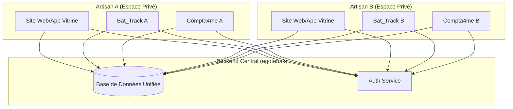

# Écosystème Egote Services - Vision et Architecture

Ce document résume la conception globale du projet **Egote**, visant à transformer la gestion artisanale via une plateforme mère et des outils digitaux intégrés.

## 1. Vision Globale
L'objectif est de créer une **plateforme "Parapluie" (Egote Services)** qui sert de point d'entrée unique pour les artisans.
Un artisan rejoint la communauté et bénéficie immédiatement d'une présence web (Site/App) et d'une suite logicielle métier.

### Les Composants de l'Écosystème
- **Egote Services (La Mère)** : La plateforme communautaire et le portail de gestion.
- **bat_track_v1 (L'Outil Terrain)** : Gestion de chantier, suivi technique, photos assistées par IA, et validation multi-parties.
- **Compta4me (L'Assistant Admin)** : Gestion de la comptabilité, facturation simplifiée et indicateurs financiers.

---

## 2. Architecture Centralisée : "egotebak"
Au lieu de multiplier les bases de données (Firestore pour le terrain, Supabase pour la vitrine, etc.), le projet converge vers un **Backend Unifié : egotebak**.

### Avantages de la Centralisation
- **Source de Vérité Unique** : Un client créé dans `bat_track` est immédiatement disponible pour une facture dans `Compta4me`.
- **Authentification Unifiée** : Un seul compte pour accéder à tous les outils.
- **Coûts Réduits** : Maintenance d'une seule infrastructure cloud (Firebase/GCP ou Supabase).
- **Analyse de Données Croisées** : Possibilité de faire des KPIs globaux (ex: Rentabilité d'un chantier = Revenus Compta - Coûts Bat_Track).

---

## 3. Structure Multi-Artisans (Multi-Tenancy)
Pour que plusieurs artisans puissent utiliser la même plateforme tout en gardant leurs données privées, l'architecture doit être segmentée :

---

## 4. Prochaines Étapes Stratégiques

1.  **Migration des Modèles** : Utiliser `shared_models` comme contrat unique entre tous les projets. (Déjà bien avancé).
2.  **Unification du Backend** : Décider entre **Firebase** (GCP) ou **Supabase** pour porter l'ensemble de `egotebak`.
3.  **Cross-Tool Linking** : S'assurer que `bat_track_v1` peut envoyer ses logs d'intervention vers le module de facturation de `Compta4me`.

---
> [!IMPORTANT]
> **Décision de Design** : La centralisation sur `egotebak` est la bonne approche technique pour éviter les silos de données. Cela nécessite une gestion rigoureuse des permissions (RLS si Supabase, Rules si Firebase) pour garantir l'étanchéité entre les données des différents artisans.
